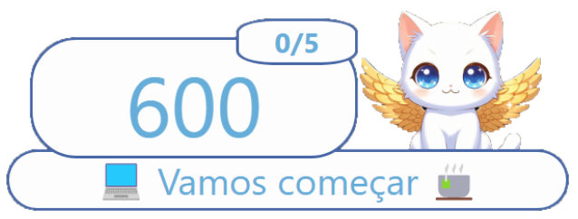

# Documentación del Proyecto Pomodoro con Twitch

## Descripción General

Esta aplicación React implementa un temporizador Pomodoro integrado con Twitch, configurado y ejecutable en el canal [Emanuwlly](https://www.twitch.tv/emanuwlly "Emanuwlly") Permite iniciar, pausar y configurar el temporizador mediante comandos en el chat de Twitch. Además, alterna entre períodos de trabajo y descanso, mostrando imágenes y etiquetas informativas en función del estado del temporizador.

## 

## Instalación y Configuración

### Requisitos Previos

- Node.js y npm instalados.
- Cuenta de Twitch y configuración del bot.
- Librerías necesarias instaladas con `npm install`.

### Estructura del Proyecto

- `App.jsx`: Componente principal que maneja el temporizador y la integración con Twitch.
- `Create_twitch_client.jsx`: Archivo que crea la conexión con Twitch mediante la API de tmi.js.
- `campana.mp3`: Sonido de alerta cuando cambia el estado del temporizador.
- `img/michi_adulto.png` y `img/michi_joven.png`: Imágenes para los diferentes estados del Pomodoro.
- `App.css`: Estilos del proyecto.

---

## Funcionamiento

### Estados del Componente `App.jsx`

- `client`: Almacena la instancia del cliente de Twitch.
- `timer`: Controla el tiempo restante del Pomodoro.
- `pomodoroTotal`: Número total de Pomodoros a completar.
- `pomoCount`: Contador de Pomodoros completados.
- `etiquetas`: Mensajes de estado para el usuario.
- `backgroundImg`: Imagen de fondo que cambia según el estado del temporizador.
- `isRunning`: Indica si el temporizador está en ejecución.
- `isBreak`: Indica si está en período de descanso.

### Efectos (`useEffect`)

1. **Inicialización de TwitchClient**: Crea y conecta el cliente al montar el componente. Se desconecta al desmontar.
2. **Manejo del Temporizador**: Controla el flujo del Pomodoro, alternando entre trabajo y descanso, actualizando el estado de la interfaz y enviando mensajes en Twitch.

---

## Comandos en Twitch

Los siguientes comandos pueden ser utilizados en el chat por el streamer o moderadores:

| Comando      | Descripción                                     |
| ------------ | ----------------------------------------------- |
| `!start`     | Inicia el temporizador si no está en ejecución. |
| `!pause`     | Pausa el temporizador en ejecución.             |
| `!min [n]`   | Establece el temporizador en `n` minutos.       |
| `!pomot [n]` | Configura la cantidad de Pomodoros a completar. |

---

## Ciclo del Temporizador

1. **Inicio (`!start`)**:

   - Si el temporizador no está en marcha, comienza con 50 minutos de trabajo.
   - Se envía un mensaje en Twitch indicando el estado de foco.
   - Se cambia la imagen de fondo y la etiqueta a "📖 é hora de focar 📖".

2. **Cambio a Descanso**:

   - Al completar un ciclo de trabajo, se inicia un descanso de 15 minutos.
   - Se envía un mensaje en Twitch indicando la pausa.
   - Se cambia la imagen de fondo y la etiqueta a "🥤Intervalo / hora do café 🍙".

3. **Finalización**:
   - Al completar todos los Pomodoros establecidos, se detiene el temporizador.
   - Se envían mensajes de cierre en Twitch.
   - Se actualiza la etiqueta a "Fim da transmissão".

---

## Mejoras Futuras

- Los mensajes al chat no pueden ser enviados porque se necesitan permisos de mod por parte del bot ejecutor o credenciales que debe remitir el encargado de llevar adelante los directos. Es una mejora que se puede hacer para integrar la herramienta por completo.
- Integrar un modo manual para el timer no salte de instancia y se pueda reanudar cuando el usario lo requiera.

---

## Conclusión

Este proyecto proporciona una herramienta eficiente para gestionar sesiones de estudio o trabajo en Twitch, integrando un temporizador Pomodoro con comandos en el chat. La implementación en React asegura una interfaz dinámica y personalizable.

# Documentação do Projeto Pomodoro com Twitch

## Visão Geral

Este aplicativo React implementa um temporizador Pomodoro integrado ao Twitch, configurado e executável no canal [Emanuwlly](https://www.twitch.tv/emanuwlly "Emanuwlly"). Permite iniciar, pausar e configurar o temporizador por meio de comandos no chat do Twitch. Além disso, alterna entre períodos de trabalho e descanso, exibindo imagens e etiquetas informativas de acordo com o estado do temporizador.

---

## Instalação e Configuração

### Requisitos Prévio

- Node.js e npm instalados.
- Conta do Twitch e configuração do bot.
- Bibliotecas necessárias instaladas com `npm install`.

### Estrutura do Projeto

- `App.jsx`: Componente principal que gerencia o temporizador e a integração com o Twitch.
- `Create_twitch_client.jsx`: Arquivo que cria a conexão com o Twitch por meio da API do tmi.js.
- `campana.mp3`: Som de alerta quando o estado do temporizador muda.
- `img/michi_adulto.png` e `img/michi_joven.png`: Imagens para os diferentes estados do Pomodoro.
- `App.css`: Estilos do projeto.

---

## Funcionamento

### Estados do Componente `App.jsx`

- `client`: Armazena a instância do cliente do Twitch.
- `timer`: Controla o tempo restante do Pomodoro.
- `pomodoroTotal`: Número total de Pomodoros a serem concluídos.
- `pomoCount`: Contador de Pomodoros concluídos.
- `etiquetas`: Mensagens de status para o usuário.
- `backgroundImg`: Imagem de fundo que muda de acordo com o estado do temporizador.
- `isRunning`: Indica se o temporizador está em execução.
- `isBreak`: Indica se está no período de descanso.

### Efeitos (`useEffect`)

1. **Inicialização do TwitchClient**: Cria e conecta o cliente ao montar o componente. Desconecta ao desmontar.
2. **Gerenciamento do Temporizador**: Controla o fluxo do Pomodoro, alternando entre trabalho e descanso, atualizando o estado da interface e enviando mensagens no Twitch.

---

## Comandos no Twitch

Os seguintes comandos podem ser usados no chat pelo streamer ou moderadores:

| Comando      | Descrição                                               |
| ------------ | ------------------------------------------------------- |
| `!start`     | Inicia o temporizador se não estiver em execução.       |
| `!pause`     | Pausa o temporizador em execução.                       |
| `!min [n]`   | Define o temporizador para `n` minutos.                 |
| `!pomot [n]` | Configura a quantidade de Pomodoros a serem concluídos. |

---

## Ciclo do Temporizador

1. **Início (`!start`)**:

   - Se o temporizador não estiver em execução, começa com 50 minutos de trabalho.
   - Uma mensagem é enviada no Twitch indicando o estado de foco.
   - A imagem de fundo e a etiqueta mudam para "📖 é hora de focar 📖".

2. **Mudança para Descanso**:

   - Ao completar um ciclo de trabalho, inicia um descanso de 15 minutos.
   - Uma mensagem é enviada no Twitch indicando a pausa.
   - A imagem de fundo e a etiqueta mudam para "🥤Intervalo / hora do café 🍙".

3. **Finalização**:
   - Ao concluir todos os Pomodoros definidos, o temporizador para.
   - Mensagens de encerramento são enviadas no Twitch.
   - A etiqueta é atualizada para "Fim da transmissão".

---

## Melhorias Futuras

- As mensagens no chat não podem ser enviadas porque o bot precisa de permissões de moderador ou credenciais fornecidas pelo responsável pelas transmissões. Esta é uma melhoria que pode ser feita para integrar completamente a ferramenta.
- Integrar um modo manual para que o timer não pule de instância e possa ser retomado quando o usuário desejar.

---

## Conclusão

Este projeto fornece uma ferramenta eficiente para gerenciar sessões de estudo ou trabalho no Twitch, integrando um temporizador Pomodoro com comandos no chat. A implementação em React garante uma interface dinâmica e personalizável.

# Pomodoro Project Documentation with Twitch

## Overview

This React application implements a Pomodoro timer integrated with Twitch, configured and executable on the channel [Emanuwlly](https://www.twitch.tv/emanuwlly "Emanuwlly"). It allows starting, pausing, and configuring the timer via commands in the Twitch chat. Additionally, it alternates between work and break periods, displaying images and informative labels based on the timer's state.

---

## Installation and Setup

### Prerequisites

- Node.js and npm installed.
- Twitch account and bot configuration.
- Required libraries installed with `npm install`.

### Project Structure

- `App.jsx`: Main component that manages the timer and Twitch integration.
- `Create_twitch_client.jsx`: File that creates the connection with Twitch using the tmi.js API.
- `campana.mp3`: Alert sound when the timer state changes.
- `img/michi_adulto.png` and `img/michi_joven.png`: Images for different Pomodoro states.
- `App.css`: Project styles.
  

---

## Functionality

### States of the `App.jsx` Component

- `client`: Stores the Twitch client instance.
- `timer`: Controls the remaining Pomodoro time.
- `pomodoroTotal`: Total number of Pomodoros to complete.
- `pomoCount`: Counter for completed Pomodoros.
- `etiquetas`: Status messages for the user.
- `backgroundImg`: Background image that changes according to the timer state.
- `isRunning`: Indicates whether the timer is running.
- `isBreak`: Indicates whether it's in a break period.

### Effects (`useEffect`)

1. **TwitchClient Initialization**: Creates and connects the client when the component mounts. Disconnects when unmounting.
2. **Timer Management**: Controls the Pomodoro flow, alternating between work and break sessions, updating the interface state, and sending messages in Twitch.

---

## Twitch Commands

The following commands can be used in the chat by the streamer or moderators:

| Command      | Description                               |
| ------------ | ----------------------------------------- |
| `!start`     | Starts the timer if it is not running.    |
| `!pause`     | Pauses the running timer.                 |
| `!min [n]`   | Sets the timer to `n` minutes.            |
| `!pomot [n]` | Sets the number of Pomodoros to complete. |

---

## Timer Cycle

1. **Start (`!start`)**:

   - If the timer is not running, it starts with 50 minutes of work.
   - A message is sent on Twitch indicating the focus state.
   - The background image and label change to "📖 It's time to focus 📖".

2. **Switch to Break**:

   - After completing a work cycle, a 15-minute break starts.
   - A message is sent on Twitch indicating the break.
   - The background image and label change to "🥤Break time / coffee time 🍙".

3. **Completion**:
   - After completing all set Pomodoros, the timer stops.
   - Closing messages are sent on Twitch.
   - The label updates to "End of the stream."

---

## Future Improvements

- Messages in the chat cannot be sent because the bot requires moderator permissions or credentials provided by the person managing the live streams. This is an improvement that can be made for full tool integration.
- Integrate a manual mode so the timer does not automatically jump to the next instance and can be resumed when the user requires it.

---

## Conclusion

This project provides an efficient tool for managing study or work sessions on Twitch, integrating a Pomodoro timer with chat commands. The React implementation ensures a dynamic and customizable interface.
